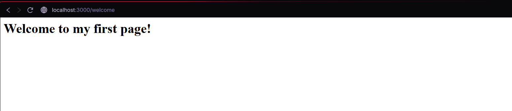
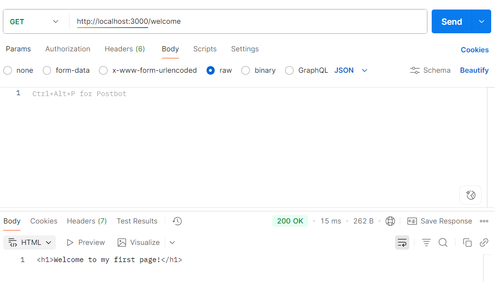
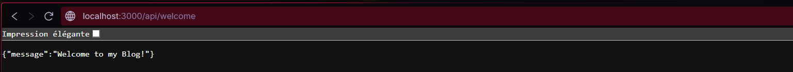
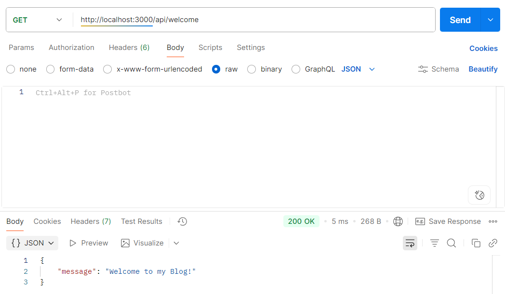
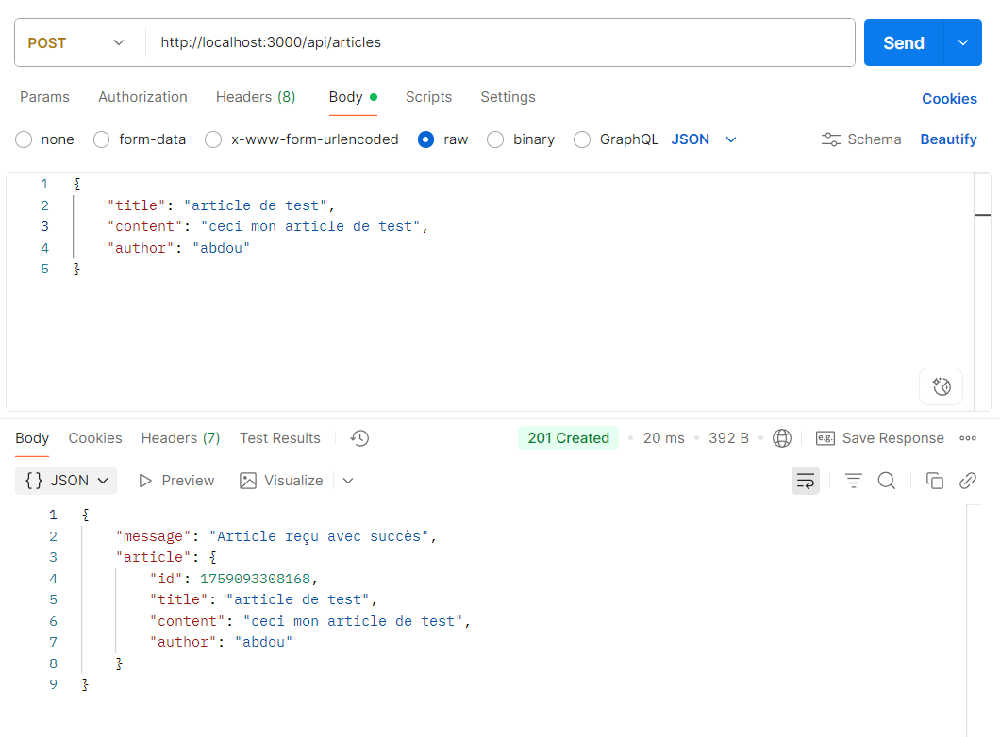
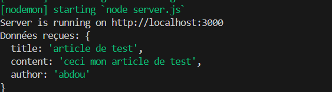
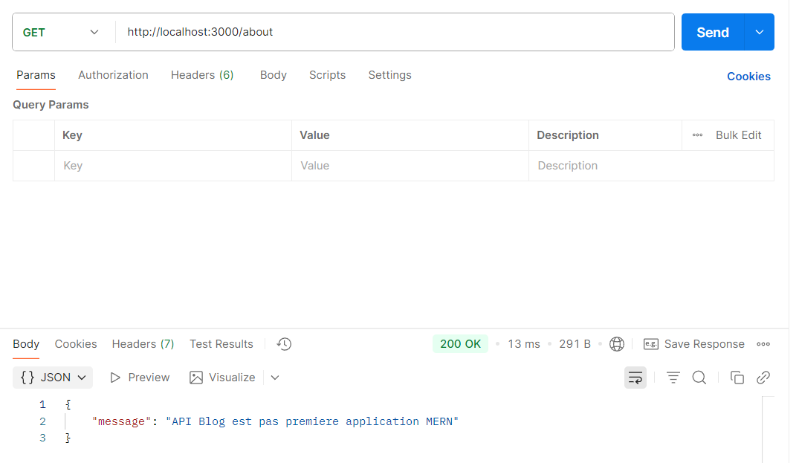
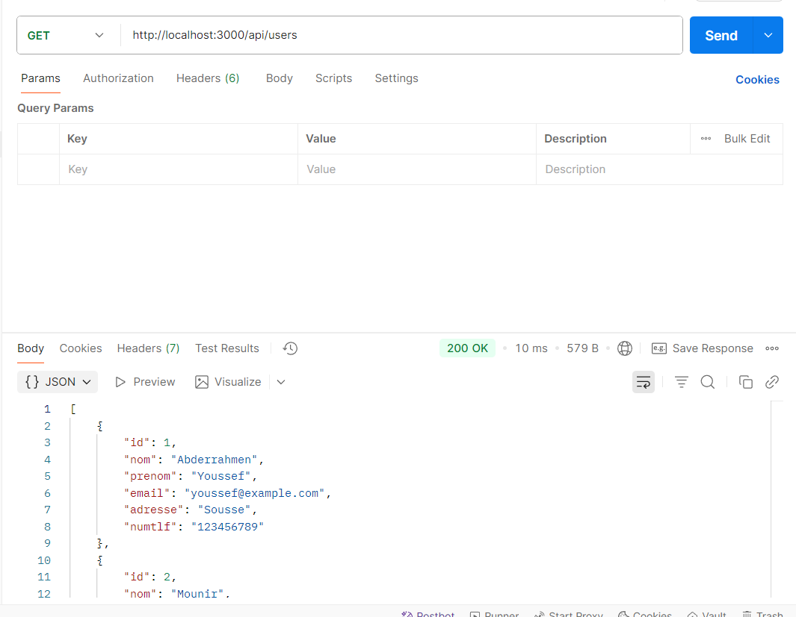
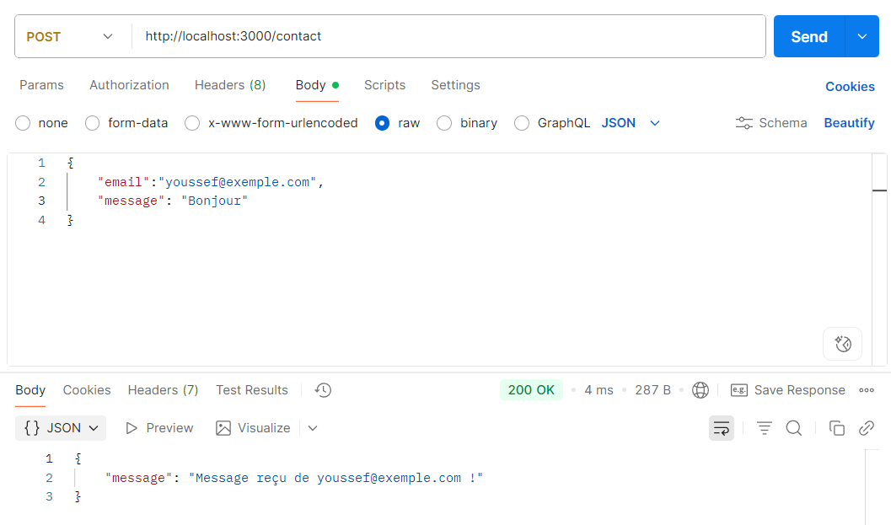

# Compte Rendu N°1 - Fondations Back-end

## Introduction

Ce compte rendu présente le travail réalisé lors de la première séance pratique sur le développement d'une API REST avec Node.js et Express.js. J'ai développé plusieurs endpoints pour comprendre les concepts fondamentaux des APIs web.

## Concepts Appris

### 1. API First
L'approche **API First** consiste à concevoir et développer l'API avant l'interface utilisateur. Cette méthode permet de :
- Définir clairement les contrats d'interface entre le frontend et le backend
- Faciliter le travail en équipe (frontend/backend en parallèle)
- Assurer une meilleure architecture et une maintenance simplifiée
- Permettre la réutilisation de l'API par différents clients (web, mobile, etc.)

### 2. L'Event Loop et l'I/O non-bloquant
Node.js utilise un modèle événementiel basé sur l'**Event Loop** qui permet de gérer les opérations I/O de manière non-bloquante :
- **Event Loop** : Boucle principale qui traite les événements et les callbacks en continu
- **I/O non-bloquant** : Les opérations d'entrée/sortie ne bloquent pas l'exécution du programme
- Cela permet à Node.js de traiter de nombreuses requêtes simultanément avec un seul thread principal
- Les opérations asynchrones sont déléguées au système d'exploitation et leurs résultats sont traités via des callbacks

## Développement des Routes

### Configuration initiale
```javascript
const express = require('express')
const app = express()
const PORT = 3000
app.use(express.json()) // Middleware pour parser le JSON
```

### 1. Route GET /welcome - Réponse HTML

**Implémentation :**
```javascript
app.get('/welcome', (req, res) => {
    res.status(200).send('<h1>Welcome to my first page!</h1>')
})
```

**Explication :** Cette route accepte une requête GET et renvoie du contenu HTML avec un code de statut 200 (succès). Toutes les routes Express prennent toujours les paramètres `req` (request) et `res` (response).

**Tests réalisés :**
-  - Test dans le navigateur
-  - Test avec Postman

### 2. Route GET /api/welcome - Réponse JSON

**Implémentation :**
```javascript
app.get('/api/welcome', (req, res) => {
    res.status(200).json({ message: 'Welcome to my Blog!' }) 
})
```

**Explication :** Cette route renvoie une réponse au format JSON avec un code 200. L'utilisation de `.json()` permet de formater automatiquement la réponse en JSON.

**Tests réalisés :**
-  

-  

### 3. Route POST /api/articles - Création d'article

**Implémentation :**
```javascript
app.post('/api/articles', (req, res) => {
    const articleData = req.body
    console.log('Données reçues:', articleData)
    res.status(201).json({ 
        message: 'Article reçu avec succès', 
        article: {id: Date.now(), ...articleData} 
    })
})
```

**Explication :** 
- Cette route POST accepte des données JSON dans le corps de la requête
- `req.body` contient les données envoyées par le client (grâce au middleware `express.json()`)
- Un ID unique est généré avec `Date.now()`
- Le code 201 indique une création réussie
- `console.log()` permet d'afficher les données reçues dans la console du serveur

**Tests réalisés :**
-  - Envoi de données via Postman
-  - Affichage dans la console du serveur

## Travail Pratique Complémentaire - Travail Personnel

### 1. Route "À Propos" (GET /about)

**Implémentation personnelle :**
```javascript
app.get('/about', (req, res) => {
    res.status(200).json({ message: "API Blog est ma premiere application MERN" })
})
```

**Explication de mon implémentation :** J'ai créé cette route pour présenter l'application. Elle renvoie un message JSON décrivant le projet comme étant ma première application MERN (MongoDB, Express, React, Node.js).

**Test réalisé :**
-  - Test de la route /about

### 2. Route API Utilisateurs (GET /api/users)

**Implémentation personnelle :**
```javascript
app.get('/api/users', (req, res) => {
    const users = [
        { id: 1, nom: 'Abderrahmen', prenom: 'Youssef', email: 'youssef@example.com', adresse:"Sousse", numtlf:"123456789" },
        { id: 2, nom: 'Mounir', prenom: 'Bensalem', email: 'mounir@example.com', adresse:"Tunis", numtlf:"987654321" },
        { id: 3, nom: 'Ahmed', prenom: 'Soussi', email: 'ahmed@example.com', adresse:"Monastir", numtlf:"456789123" }
    ]
    res.status(200).json(users)
})
```

**Explication de mon implémentation :** J'ai créé un tableau d'utilisateurs factices avec des informations complètes (nom, prénom, email, adresse, numéro de téléphone). 

**Test réalisé :**
-  - Test de la route /api/users

### 3. Route de Contact (POST /contact)

**Implémentation personnelle :**
```javascript
app.post('/contact', (req, res) => {
    const { email, message } = req.body
    res.status(200).json({ message: `Message reçu de ${email} !` })
})
```

**Explication de mon implémentation :** 
- J'ai utilisé la destructuration `{ email, message }` pour extraire les données du corps de la requête
- La réponse confirme la réception du message en incluant l'email de l'expéditeur

**Test réalisé :**
-  - Test de la route /contact

## Configuration du Package.json

Avant d'utiliser les commandes, nous avons modifié le fichier `package.json` pour ajouter des scripts personnalisés dans la section `scripts` :

```json
"scripts": {
  "start": "node server.js",
  "dev": "nodemon server.js"
}
```

**Explication de ces scripts :**

### Script "start"
- **Commande :** `"start": "node server.js"`
- **Utilisation :** `npm start` ou `npm run start`
- **Fonction :** Lance le serveur en mode production avec Node.js standard
- **Caractéristiques :** 
  - Exécute le fichier `server.js` une seule fois
  - Ne redémarre pas automatiquement en cas de modification du code
  - Utilisé généralement en production ou pour des tests ponctuels

### Script "dev"
- **Commande :** `"dev": "nodemon server.js"`
- **Utilisation :** `npm run dev`
- **Fonction :** Lance le serveur en mode développement avec nodemon
- **Caractéristiques :**
  - Surveille automatiquement les modifications des fichiers
  - Redémarre le serveur à chaque sauvegarde de fichier
  - Idéal pour le développement car évite de redémarrer manuellement le serveur
  - Améliore la productivité pendant le développement

## Commandes Utilisées

```bash
# Initialisation du projet
npm init -y

# Installation d'Express
npm install express

#Installation nodemon
npm install nodemon 

# Démarrage du serveur por le developpement
npm run dev
```

## Conclusion

Ce premier travail pratique m'a permis de comprendre les concepts fondamentaux des APIs REST avec Express.js. J'ai appris à :
- Créer différents types d'endpoints (GET, POST)
- Gérer les réponses JSON et HTML
- Utiliser les middlewares Express
- Traiter les données des requêtes avec `req.body`
- Implémenter des routes personnalisées selon les besoins

