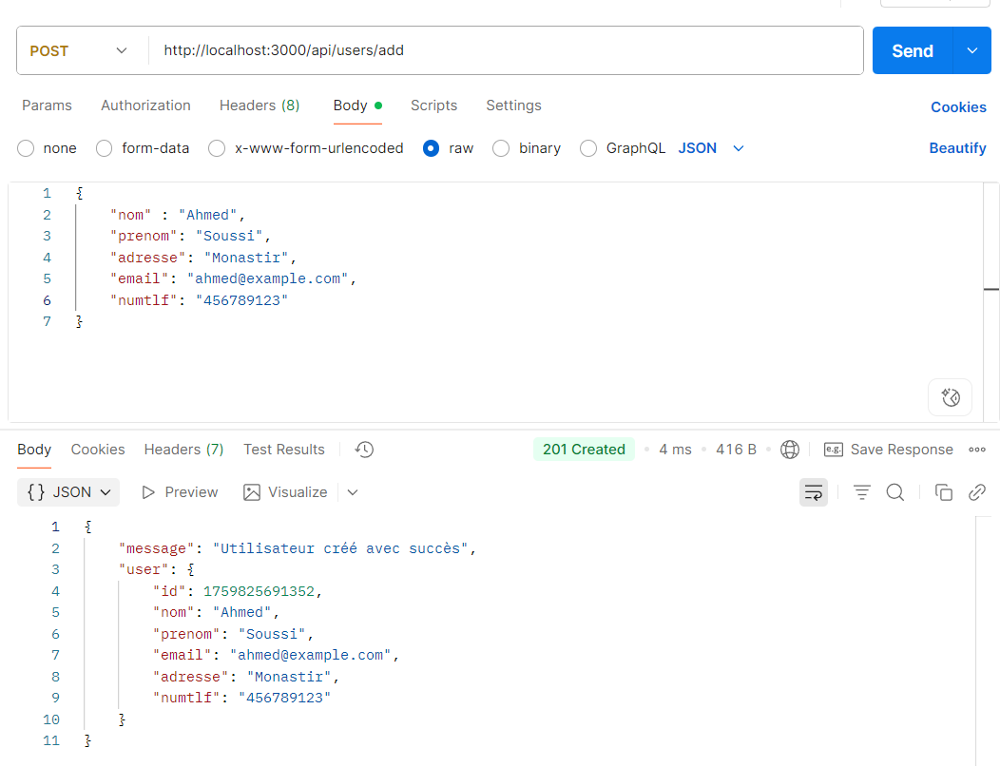

# Compte Rendu N°2 - Refactorisation et Architecture SoC

## Introduction

Ce compte rendu présente le travail de refactorisation réalisé lors de la deuxième séance pratique. Nous avons transformé notre API monolithique en une architecture modulaire basée sur le principe de **Separation of Concerns (SoC)**. Cette refactorisation a permis d'améliorer significativement la maintenabilité, la lisibilité et la collaboration dans le développement de notre API Blog.

## De l'Architecture Monolithique vers SoC

### Problèmes de l'ancienne architecture

Dans le compte rendu précédent, notre code était entièrement concentré dans un seul fichier `server.js`. Cette approche monolithique présentait plusieurs problèmes majeurs :

- **Illisibilité** : Toutes les routes et logiques métier étaient mélangées dans un seul fichier
- **Difficile à maintenir** : Modifications complexes et risquées à cause de la forte interdépendance
- **Non-collaboratif** : Impossible pour plusieurs développeurs de travailler sur différentes fonctionnalités simultanément
- **Pas de réutilisabilité** : Code dupliqué et fonctions non modulaires
- **Scalabilité limitée** : Ajout de nouvelles fonctionnalités rendait le code de plus en plus complexe

### Avantages de la nouvelle architecture SoC

La **Separation of Concerns** nous a permis de diviser notre application en modules distincts :

- **Maintenance facilitée** : Chaque module a une responsabilité claire et peut être modifié indépendamment
- **Développement structuré** : Séparation claire entre la logique métier, le routage et la configuration serveur
- **Aménagement collaboratif** : Plusieurs développeurs peuvent travailler sur différents contrôleurs simultanément
- **Réutilisabilité** : Les contrôleurs peuvent être réutilisés dans d'autres parties de l'application
- **Lisibilité améliorée** : Code organisé et facile à comprendre
- **Tests simplifiés** : Chaque module peut être testé indépendamment

## Architecture de l'Application

Notre nouvelle structure suit le pattern MVC (Modèle-Vue-Contrôleur) adapté pour une API :

```
mon-api-blog/
├── server.js          # Point d'entrée et configuration du serveur
├── controllers/       # Logique métier
│   ├── articleController.js
│   └── userController.js
├── routes/           # Définition des routes
│   ├── articleRoutes.js
│   └── userRoutes.js
└── package.json      # Configuration du projet
```

## Les Contrôleurs - Logique Métier

### Rôle des Contrôleurs

Les **contrôleurs** contiennent la logique métier de notre application. Ils sont responsables de :
- Traiter les données reçues dans les requêtes
- Effectuer les validations nécessaires
- Préparer les réponses à renvoyer au client
- Gérer les erreurs et les cas d'exception

### Le mot-clé `module.exports`

`module.exports` est le mécanisme de Node.js pour exporter des fonctions, objets ou variables d'un module pour qu'ils puissent être utilisés dans d'autres fichiers.

**Exemple dans `articleController.js` :**
```javascript
const apiTest = (req, res) => {
    res.status(200).json({ message: 'Welcome to my Blog!' }) 
}

const apiArticleCreate = (req, res) => {
    // Logique de création d'article
}

// Export de plusieurs fonctions
module.exports = {
    apiTest,
    apiArticleCreate,
    listeArticles,
    deleteArticle
}
```

**Avantages de cette approche :**
- **Modularité** : Chaque contrôleur est un module indépendant
- **Réutilisabilité** : Les fonctions peuvent être importées dans plusieurs fichiers
- **Organisation** : Séparation claire des responsabilités

## Les Routes - Gestion du Routage

### Rôle des Routes

Les **routes** définissent les endpoints de notre API et font le lien entre les requêtes HTTP et les contrôleurs appropriés. Elles sont responsables de :
- Définir les chemins d'accès (endpoints)
- Spécifier les méthodes HTTP (GET, POST, DELETE, etc.)
- Associer chaque route à la fonction contrôleur correspondante

### Le mot-clé `express.Router()`

`express.Router()` est une fonction d'Express.js qui crée un objet de routage modulaire. Il permet de :
- Créer des routes modulaires et montables
- Organiser les routes par fonctionnalité
- Appliquer des middlewares spécifiques à un groupe de routes

**Exemple dans `articleRoutes.js` :**
```javascript
const express = require('express');
const articleRoutes = express.Router();
const { apiTest, apiArticleCreate, listeArticles, deleteArticle } = require('../controllers/articleController');

articleRoutes.get('/test', apiTest);
articleRoutes.get('/', listeArticles);
articleRoutes.post('/add', apiArticleCreate);
articleRoutes.delete('/delete', deleteArticle);

module.exports = articleRoutes;
```

**Avantages d'`express.Router()` :**
- **Modularité** : Chaque groupe de routes est dans un fichier séparé
- **Maintenance** : Facile de modifier ou ajouter des routes
- **Lisibilité** : Structure claire et organisée

## Intégration dans le Serveur

### Utilisation d'`app.use()`

Dans `server.js`, nous utilisons `app.use()` pour intégrer nos modules de routes :

```javascript
const articleRoutes = require('./routes/articleRoutes')
const userRoutes = require('./routes/userRoutes')

// Déclaration des routes
app.use('/api/articles', articleRoutes);
app.use('/api/users', userRoutes);
```

**Explication :**
- `app.use('/api/articles', articleRoutes)` : Toutes les routes définies dans `articleRoutes` seront préfixées par `/api/articles`
- `require('./routes/articleRoutes')` : Import du module de routes
- Cette approche permet de centraliser la configuration des routes principales

## Implémentation avec les Articles

### Test de l'API Initial


La page d'accueil confirme que notre serveur fonctionne correctement avec la nouvelle architecture.

### Test des Articles


Test de l'endpoint `/api/articles/test` qui vérifie la connectivité avec le contrôleur des articles.

### Récupération des Articles (GET)


L'endpoint `GET /api/articles` retourne la liste complète des articles. Cette fonctionnalité est gérée par la fonction `listeArticles` du contrôleur.

**Fonctionnalité implémentée :**
```javascript
const listeArticles = (req, res) => {
    const articles = [
        { id: 1, title: 'Premier Article', content: 'Contenu...', author: 'Youssef' },
        { id: 2, title: 'Deuxième Article', content: 'Contenu...', author: 'Mounir' },
        { id: 3, title: 'Troisième Article', content: 'Contenu...', author: 'Ahmed' }
    ]
    res.status(200).json(articles)
}
```

### Ajout d'Article (POST)


L'endpoint `POST /api/articles/add` permet de créer un nouvel article. Le contrôleur valide les données reçues et confirme la création.

**Validations implémentées :**
- Vérification de la présence du corps de requête
- Validation des champs obligatoires (title, content, author)
- Réponse avec code 201 en cas de succès

### Suppression d'Article (DELETE)


L'endpoint `DELETE /api/articles/delete` permet de supprimer un article selon son ID. Le contrôleur traite la demande et confirme la suppression.

## Travail Pratique Complémentaire - Gestion des Utilisateurs

### Récupération des Utilisateurs (GET)


L'endpoint `GET /api/users` retourne la liste complète des utilisateurs. Cette fonctionnalité démontre la réutilisabilité de notre architecture pour différentes entités.

**Implémentation dans `userController.js` :**
```javascript
const getAllUsers = (req, res) => {
    const users = [
        { id: 1, nom: 'Abderrahmen', prenom: 'Youssef', email: 'youssef@example.com', adresse:"Sousse", numtlf:"123456789" },
        { id: 2, nom: 'Mounir', prenom: 'Bensalem', email: 'mounir@example.com', adresse:"Tunis", numtlf:"987654321" },
        { id: 3, nom: 'Ahmed', prenom: 'Soussi', email: 'ahmed@example.com', adresse:"Monastir", numtlf:"456789123" }
    ]
    res.status(200).json(users)
}
```

### Ajout d'Utilisateur (POST)



L'endpoint `POST /api/users/add` permet de créer un nouvel utilisateur avec validation complète des champs requis.

**Fonctionnalités implémentées :**
- Validation de tous les champs (nom, prénom, email, adresse, numtlf)
- Génération automatique d'ID unique
- Réponse structurée avec confirmation de création

## Avantages de la Nouvelle Architecture

### 1. Maintenance Simplifiée
- **Localisation des modifications** : Pour modifier la logique des articles, il suffit d'éditer `articleController.js`
- **Isolation des erreurs** : Un bug dans le contrôleur utilisateur n'affecte pas les articles
- **Tests ciblés** : Chaque module peut être testé indépendamment

### 2. Développement Collaboratif
- **Division du travail** : Un développeur peut travailler sur `userController.js` pendant qu'un autre travaille sur `articleController.js`
- **Conflits réduits** : Moins de conflits Git grâce à la séparation des fichiers
- **Spécialisation** : Chaque développeur peut se spécialiser sur certains modules

### 3. Structure Évolutive
- **Ajout de nouvelles fonctionnalités** : Facile d'ajouter de nouveaux contrôleurs (ex: `commentController.js`)
- **Réutilisabilité** : Les contrôleurs peuvent être réutilisés dans d'autres projets
- **Scalabilité** : L'architecture peut facilement supporter la croissance de l'application

### 4. Lisibilité Améliorée
- **Code organisé** : Chaque fichier a une responsabilité claire
- **Navigation facilitée** : Facile de trouver le code responsable d'une fonctionnalité
- **Documentation naturelle** : La structure des dossiers documente l'architecture

## Comparaison Avant/Après

| Aspect | Architecture Monolithique | Architecture SoC |
|--------|---------------------------|------------------|
| **Fichiers** | 1 seul fichier `server.js` | 5 fichiers organisés |
| **Maintenance** | Difficile, tout est mélangé | Facile, modules séparés |
| **Collaboration** | Impossible, conflits constants | Facile, travail parallèle |
| **Tests** | Complexe, tout interconnecté | Simple, modules isolés |
| **Évolutivité** | Limitée, code devient lourd | Excellente, ajout facile |
| **Lisibilité** | Mauvaise, code confus | Excellente, structure claire |

## Conclusion

Cette refactorisation vers une architecture SoC représente une amélioration majeure de notre API Blog. Elle nous a permis de :

1. **Transformer un code illisible** en une structure claire et organisée
2. **Faciliter la maintenance** grâce à la séparation des responsabilités
3. **Permettre le développement collaboratif** avec des modules indépendants
4. **Améliorer l'évolutivité** de notre application

Les concepts clés appris incluent :
- **Les contrôleurs** : Logique métier centralisée avec `module.exports`
- **Les routes** : Gestion du routage avec `express.Router()`
- **L'intégration** : Utilisation d'`app.use()` pour connecter les modules

Cette nouvelle architecture constitue une base solide pour le développement futur de notre application MERN et démontre l'importance des bonnes pratiques en développement logiciel.