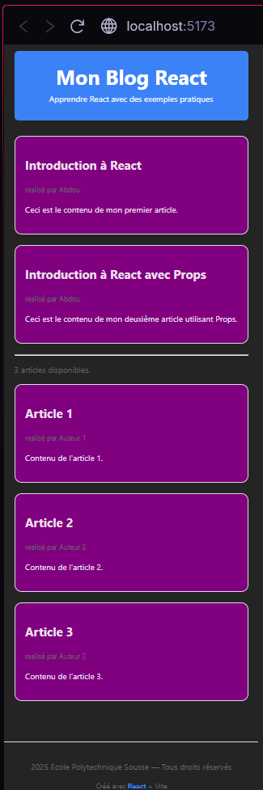

# Compte Rendu N°3 - Frontend React : Architecture et Composants

## Introduction

Ce compte rendu présente la réalisation de la partie frontend de notre application blog avec **React**. Nous avons conçu une interface moderne et modulaire, composée de trois composants principaux, en appliquant les bonnes pratiques de la programmation React (props, export, etc.).

## Structure des Composants

Notre application React est structurée autour de trois composants réutilisables :

- **Header** : Affiche le titre principal et un sous-titre de l'application.
- **Article** et **ArticleProps** : Affichent le contenu d'un article de blog, avec des styles personnalisés.
- **Footer** : Affiche les informations de pied de page.

### 1. Composant Header

**Implémentation :**
```jsx
function Header({ title, subtitle }) {
  return (
    <header
      style={{
        backgroundColor: '#3b82f6',
        color: 'white',
        padding: '30px 20px',
        textAlign: 'center',
        marginBottom: '30px',
        borderRadius: '8px'
      }}
    >
      <h1 style={{ margin: 0, fontSize: '2.5rem' }}>
        {title}
      </h1>
      {subtitle && (
        <p style={{ margin: '10px 0 0', opacity: 0.9 }}>
          {subtitle}
        </p>
      )}
    </header>
  );
}
export default Header;
```

- **Export** : Le composant est exporté par défaut (`export default Header;`), ce qui permet de l'importer facilement dans d'autres fichiers.
- **Props** : `title` et `subtitle` sont passés en tant que propriétés pour personnaliser le contenu du header.

### 2. Composant Article

**Implémentation :**
```jsx
function Article({ title , author , content}) {
    return (
        <article style ={{
            border: '1px solid #ddd',
            padding: '20px',
            backgroundColor: 'purple',
            marginBottom: '20px',
            borderRadius: '14px'
        }}>
            <h2>{title}</h2>
            <p style={{
                color: '#666',
                fontSize: '14px',
            }}>
                réalisé par {author}
            </p>
            <p>
                {content}
            </p>
        </article>
    )
}
export default Article;
```

- **Export** : Export par défaut pour une utilisation simple.
- **Props** : Les propriétés `title`, `author` et `content` sont utilisées pour afficher dynamiquement les informations de chaque article.

### 3. Composant ArticleProps

**Implémentation :**
```jsx
function ArticleProps(Props) {
    return (
        <article style ={{
            border: '1px solid #ddd',
            padding: '20px',
            backgroundColor: 'purple',
            marginBottom: '20px',
            borderRadius: '14px'
        }}>
            <h2>{Props.title}</h2>
            <p style={{
                color: '#666',
                fontSize: '14px',
            }}>
                réalisé par {Props.author}
            </p>
            <p>
                {Props.content}
            </p>
        </article>
    )
}
export default ArticleProps;
```

- **Différence** : Ici, les props ne sont pas déstructurées dans la signature de la fonction, mais accédées via `Props.nomDeLaProp`.

### 4. Composant Footer

**Implémentation :**
```jsx
function Footer({ author, year }) {
  return (
    <footer
      style={{
        textAlign: 'center',
        padding: '20px',
        marginTop: '40px',
        borderTop: '2px solid #ddd',
        color: '#666'
      }}
    >
      <p>{year} {author} — Tous droits réservés</p>
      <p style={{ fontSize: '14px', marginTop: '10px' }}>
        Créé avec <span style={{ color: '#3b82f6', fontWeight: 'bold' }}>React</span> + Vite
      </p>
    </footer>
  );
}
export default Footer;
```

- **Props** : `author` et `year` sont passés pour personnaliser le pied de page.

## Utilisation et Export des Composants


Tous les composants sont exportés par défaut, ce qui permet de les importer facilement dans le fichier principal (`App.jsx`) :
```jsx
import Header from './components/Header';
import Article from './components/Article';
import ArticleProps from './components/ArticleProps';
import Footer from './components/Footer';
```

### Utilisation concrète dans `App.jsx`

Dans le fichier `App.jsx`, nous utilisons nos composants de la manière suivante :

- **Header** est utilisé en haut de la page pour afficher le titre et le sous-titre du blog.
- **Article** et **ArticleProps** sont utilisés pour afficher des articles statiques, puis une liste dynamique d'articles à partir d'un tableau.
- **Footer** est affiché en bas de la page avec l'année courante.

**Extrait de `App.jsx` :**
```jsx
function App() {
  const articles = [
    { id: 1, title: "Article 1", author: "Auteur 1", content: "Contenu de l'article 1." },
    { id: 2, title: "Article 2", author: "Auteur 2", content: "Contenu de l'article 2." },
    { id: 3, title: "Article 3", author: "Auteur 3", content: "Contenu de l'article 3." }
  ];
  const currentYear = new Date().getFullYear();

  return (
    <div>
      <Header title="Mon Blog React" subtitle="Apprendre React avec des exemples pratiques" />

      {/* Article statique */}
      <Article
        title="Introduction à React"
        author="Abdou"
        content="Ceci est le contenu de mon premier article."
      />
      <ArticleProps
        title="Introduction à React avec Props"
        author="Abdou"
        content="Ceci est le contenu de mon deuxième article utilisant Props."
      />

      {/* Liste dynamique d'articles */}
      {articles.map((article) => (
        <Article
          key={article.id}
          title={article.title}
          author={article.author}
          content={article.content}
        />
      ))}

      <Footer author="Ecole Polytechnique Sousse" year={currentYear} />
    </div>
  );
}
```

Cette structure montre comment on combine l'import, l'export et l'utilisation concrète des composants pour construire l'interface de notre application React.

## Explication sur la Prop `key` en React

La prop spéciale `key` en React est utilisée lors du rendu de listes d'éléments (par exemple, un tableau d'articles). Elle permet à React d'identifier de façon unique chaque élément de la liste et d'optimiser les mises à jour du DOM virtuel.

- **Rôle de `key`** :
  - Permet à React de repérer rapidement quel élément a été ajouté, supprimé ou modifié.
  - Améliore les performances lors du rendu de listes dynamiques.
  - La valeur de `key` doit être unique parmi les éléments frères (souvent un identifiant ou l'index du tableau).

**Exemple d'utilisation :**
```jsx
{articles.map(article => (
  <Article key={article.id} {...article} />
))}
```


## Capture d'écran de l'application fonctionnelle



## Conclusion

Ce travail m'a permis de :
- Comprendre la structuration d'une application React moderne
- Créer et exporter des composants réutilisables
- Maîtriser le passage et la déstructuration des props
- Comprendre l'importance de la prop `key` pour le rendu des listes
- Appliquer des styles personnalisés pour une interface attractive


